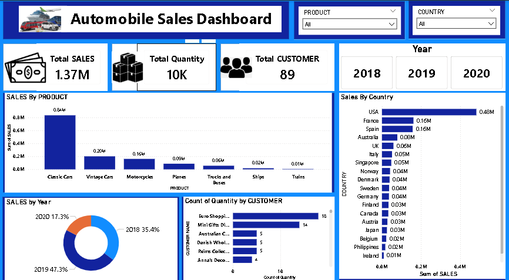

# Automobile Sales Dashboard & Analytics

## 📌 Project Overview
This Business Intelligence project focuses on analyzing global automobile commercial sales data across multiple years (2018–2020). Using Power BI and Advanced Excel, I transformed raw transactional data into a dynamic executive dashboard to track key business performance indicators (KPIs), product revenue, regional market distribution, and customer buying behaviors.

## 📊 Business Metrics & Key Achievements
Total Revenue Generated: Successfully tracked and verified 1.37M in Total Sales.
Order Fulfillment: Maintained inventory and shipping visibility over a total volume of 10K Quantities sold.
Customer Lifetime Reach: Analyzed buying trends for 89 unique B2B corporate customers globally.

## 💡 Key Business Insights
Dominant Product Segment: Classic Cars is the clear market leader, contributing the highest share of 0.84M in sales, followed by Vintage Cars (0.20M).
Geographical Leader: The USA stands out as the primary market with 0.48M in total revenue, while France and Spain follow closely with 0.16M each.
Sales Growth Trends: 2019 was the peak performance year, securing 47.3% of total lifetime sales, showing strong year over year momentum compared to 2018 (35.4%).

## 🛠️ Tech Stack & Skills Demonstrated
Data Visualizations: Bar Charts, Donut Charts, KPI Cards, and Dynamic Tables.
Interactive Features: Implemented Product and Country slicers alongside Year buttons for custom deep dives.
Tools: Power BI Desktop, Power Query, Microsoft Excel, MYSQL.
 [MySQL Queries File](https://github.com/AHSAN48692/automobile_sales/blob/main/auto%20sql.sql)

## 📷 Dashboard Preview

